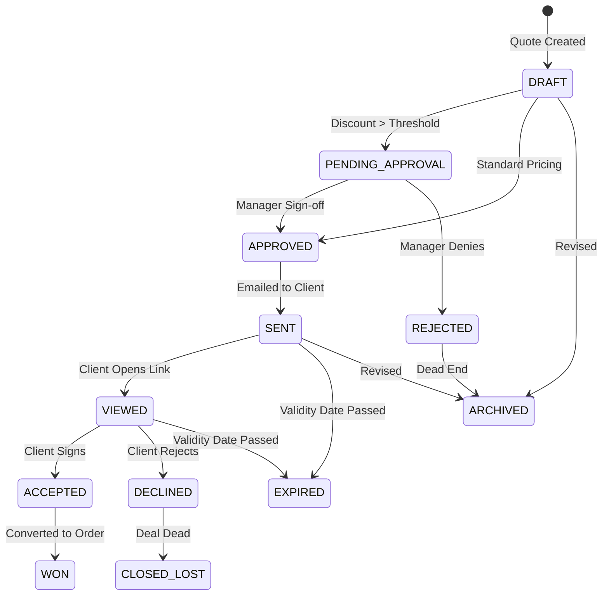
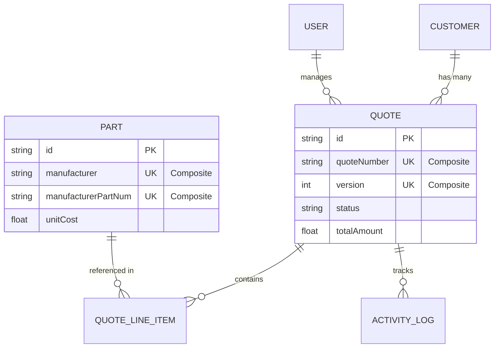

# QuoteFlow — Architecture & System Design

> This document outlines the core structural patterns, data modeling decisions, and engineering trade-offs established for QuoteFlow. Every decision is grounded in auditability, data integrity, and deterministic execution.

---

## 1. System Diagrams

### Quote Lifecycle State Machine

This diagram maps the 12 distinct statuses a quote can enter, including the explicit managerial approval gate for high-discount quotes.

### Entity-Relationship (ER) Diagram

This outlines the core data models, highlighting the composite keys used to guarantee data integrity across external component ingestion and quote versioning.

---

## 2. System Context & Runtime Boundaries

### Next.js (App Router) & Strict Node.js Runtime Enforcement

**Decision:** Core backend route handlers — including authentication (`app/api/auth/[...nextauth]/route.ts`) and database mutations — are explicitly locked to the Node.js runtime via `export const runtime = 'nodejs';`.

**Rationale:** By default, modern Next.js build toolchains push route handlers toward lightweight Edge isolates. However, the QuoteFlow stack relies on native C++ bindings and buffers (`bcryptjs` for password hashing) and TCP wire-protocol database drivers (`pg`), both of which are incompatible with the Edge Runtime. Enforcing Node.js guarantees stable cryptographic execution and persistent database sockets.

---

## 3. Role-Based Access Control (RBAC) Governance

### Three-Role Model (`ADMIN` / `MANAGER` / `SALES`) Justification

**Design Rationale:** An explicit `ADMIN` role is retained beyond the two-role operational model (`MANAGER` / `SALES`) to strictly decouple system-level user provisioning, role assignments, and audit log governance from day-to-day quotation approval workflows.

**Authentication vs. Authorization Separation:**

- **Authentication** (Session-Gating) via Auth.js v5 verifies identity: `if (!session?.user)`.
- **Authorization** (Role-Gating) is deliberately decoupled and enforced at the domain-action layer when handling quote approvals and price-override thresholds.

**Server-Side Guardrails:** Access control policies are enforced directly at the Server Action mutation layer (`src/lib/rbac.ts`). Client-side disabling is purely for UX — the true security boundary prevents API tampering and unauthorized peer-quote revisions before any database transaction is initiated.

**Threshold-Based Routing:** Business logic dynamically intercepts quote submissions. Discounts exceeding enterprise margins (`> 15.0%`) are automatically routed to `PENDING_APPROVAL` status, requiring managerial sign-off before the quote can progress.

---

## 4. Database Layer & Connection Strategy

### Prisma 7 Driver Adapter & Native Postgres Pooling

**Decision:** Database connectivity is routed through Prisma 7's `@prisma/adapter-pg` wrapper executing over a native `pg.Pool` instance (`src/lib/db.ts`).

**Rationale:** Modern Prisma architectures decouple query compilation from wire-protocol execution. Managing a centralized native connection pool prevents connection exhaustion during Next.js Hot Module Replacement (HMR) in development and ensures deterministic socket management across automated CLI scripts (`seed.ts`).

---

## 5. Domain Modeling & Inventory Integrity

### B2B Component Deduplication via Composite Natural Keys

**Decision:** The `Part` entity utilizes a **Composite Unique Natural Key** (`@@unique([manufacturer, manufacturerPartNum])`) alongside a surrogate UUID primary key (`id String @id @default(uuid())`).

**Rationale:**

- **Surrogate UUID:** Serves as a stable foreign-key reference for downstream Bill of Materials (BOM) line items and quotation versions without exposing raw catalog strings in URLs or API responses.
- **Composite Natural Key:** Electronic components are universally identified by their Manufacturer and Manufacturer Part Number (MPN). Relying solely on a UUID creates a race-condition vulnerability where concurrent distributor API ingestions (e.g., Mouser vs. Digi-Key) could insert duplicate rows for the same physical part. The composite constraint enforces database-level idempotency regardless of the ingestion source.

### Immutable Quote Versioning

**Decision:** The `Quote` model utilizes a compound unique index across `quoteNumber` and `version` (`@@unique([quoteNumber, version])`).

**Rationale:** In enterprise ERP systems, a quotation must retain a consistent parent reference number across its entire negotiation lifecycle. A standard `@unique` constraint on `quoteNumber` alone blocks revision creation entirely, while omitting uniqueness exposes the table to duplicate draft generation under concurrent requests. The compound constraint ensures deterministic version ordering (`v1`, `v2`, `v3`) without race conditions.

---

## 6. Transactional Integrity & Financial Precision

### Atomic Revision Engine

**Decision:** Quote revisions execute via multi-operation atomic database transactions (`db.$transaction`).

**Rationale:** Revising a quote requires two tightly coupled database writes: demoting the active version to an immutable `ARCHIVED` status and inserting a successor draft. Executing these sequentially without ACID transactional guarantees risks orphaned quote states or corrupted audit trails if intermittent server failures occur mid-mutation.

### Zero-Clamping Financial Calculation Pipeline

**Decision:** Centralized pricing logic (`src/lib/pricing.ts`) enforces strict floor constraints (`Math.max(0, ...)`) and explicit decimal-place rounding across all calculations.

**Rationale:** Floating-point precision errors and invalid negative margin or discount inputs can silently corrupt enterprise pricing models. This pipeline guarantees determinism for unit selling prices, line-item extensions, discount application, and tax aggregations — ensuring every output is a valid, non-negative currency figure.

### Data Denormalization for Frozen Historical Pricing

**Decision:** Line item prices and quote totals are hard-copied into the `QuoteLineItem` and `Quote` tables at the time of creation, rather than being dynamically recalculated via live joins to the `Part` table.

**Rationale:** A quotation is a legally binding snapshot in time. If a component manufacturer raises their `unitCost` in the central `Part` inventory table after a quote has been issued, historical and currently open quotes must not retroactively recalculate and alter their stated totals. Storing the exact mathematical output at the moment of generation guarantees absolute auditability and financial freezing across the entire quote lifecycle.

---

## 7. Client-Server State Management

### URL-Driven State Synchronization

**Decision:** Complex search and filter interfaces (e.g., `SearchFilters.tsx`) are decoupled into Client Components that imperatively manage routing state using Next.js hooks (`useRouter`, `useSearchParams`) to update the URL.

**Rationale:** Relying on native HTML forms or static `defaultValue` props within Server Components creates state desynchronization — `defaultValue` only fires on initial mount and does not respond to subsequent URL changes. Using the URL as the definitive source of truth ensures the Client UI accurately retains active filter state post-navigation without triggering full-page reloads, while cleanly delegating all data-fetching to the Server Component layer.

### Bypassing Aggressive Route Caching

**Decision:** Dynamic inventory pages opt out of static generation via `export const dynamic = "force-dynamic"`.

**Rationale:** Next.js aggressively caches Server Components at build or initial render time. For highly dynamic ERP data — such as distinct product categories or real-time stock levels — static generation serves stale results. Forcing dynamic execution instructs Next.js to bypass the Route Cache entirely, guaranteeing that all Prisma queries execute directly against the live PostgreSQL instance on every request.

---

## 8. External Integration & Development Resiliency

### Offline-First Disk-Caching for Third-Party APIs (Mouser Electronics)

**Decision:** All external catalog queries (`src/lib/mouser.ts`) pass through a cache-first filesystem interception layer stored in `.cache/mouser/` before dispatching any live outbound HTTP requests.

**Rationale:** Direct dependency on live distributor APIs during development introduces rate-limiting bottlenecks, unpredictable latency, and network fragility. Caching JSON responses locally allows automated seeding (`npm run seed`), UI testing, and CI/CD pipelines to execute in under `10ms` while fully offline. The `.cache/` directory is excluded from version control via `.gitignore` to prevent raw API responses from being committed to the repository.

---

## 9. Local Infrastructure & Idempotent Pipelines

### Isolated Docker Storage & Upsert Seeding

**Decision:** Local development databases run via Docker Compose mapped to host port `5433:5432`, with database seeding executed via `tsx --env-file=.env src/seed.ts`.

**Rationale:** Remapping the host port to `5433` prevents socket binding collisions with ambient system-level PostgreSQL installations. The automated seeding script leverages Prisma `upsert()` queries targeting the compound unique index, ensuring that container restarts (`docker compose down && docker compose up -d`) and repetitive seed executions remain fully idempotent — producing no data loss or unique-constraint violations regardless of how many times the pipeline is run.